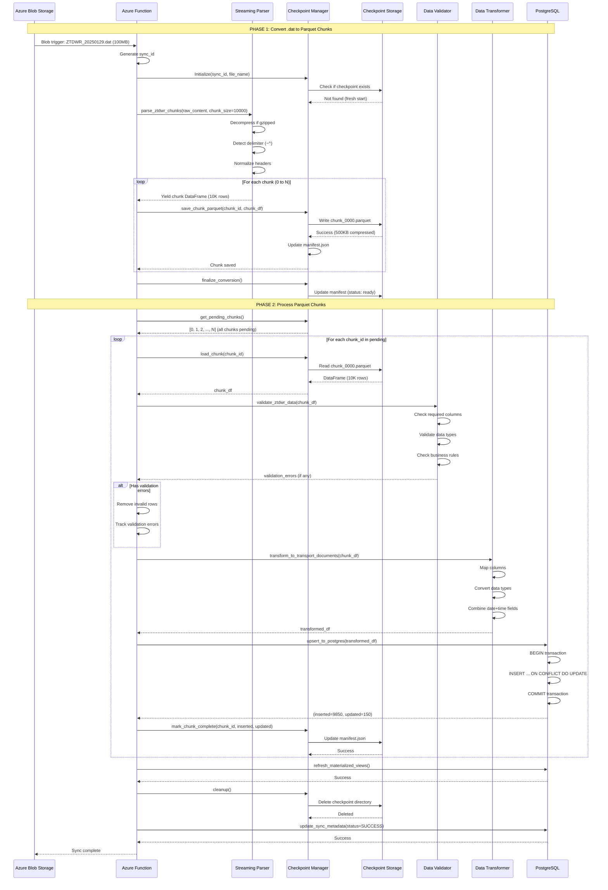
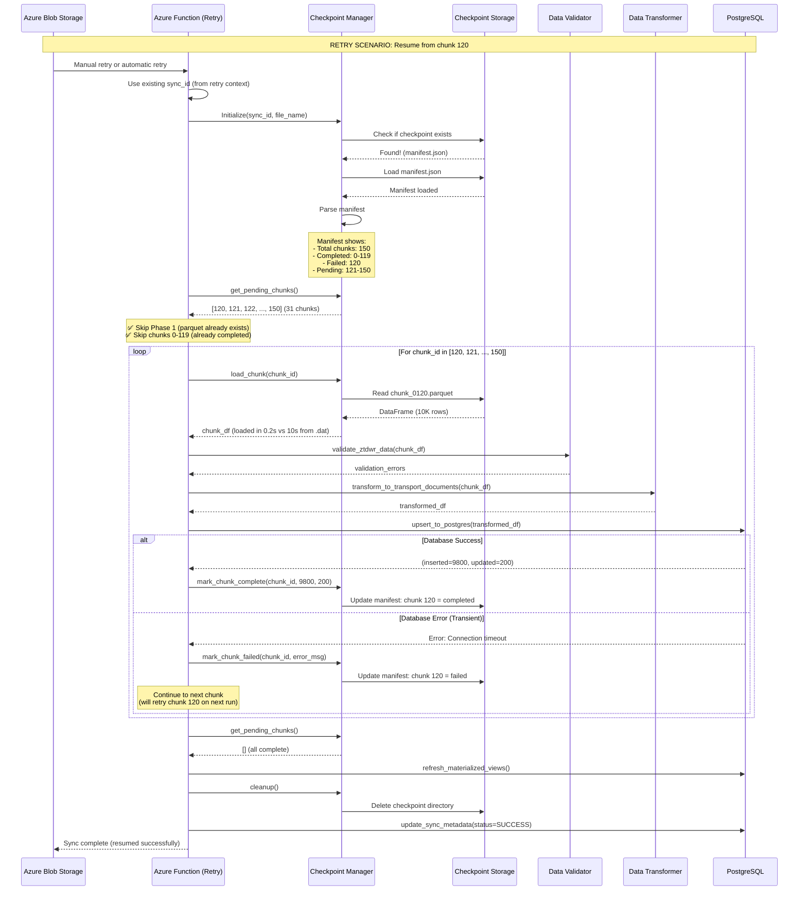
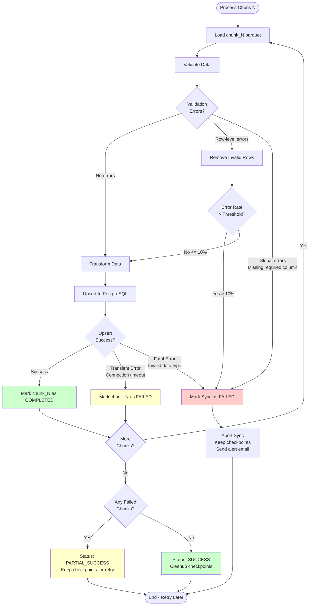
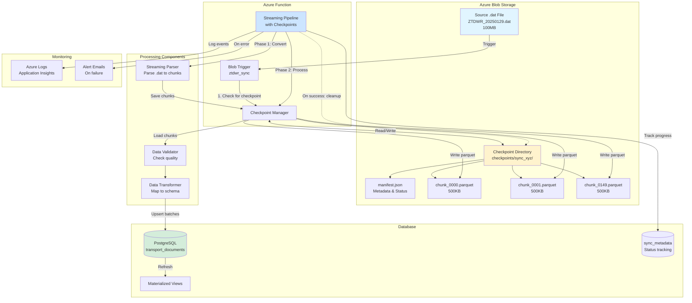

# Implementation Sequence Diagram: Parquet-Based Checkpointing ETL

## Overview

This document provides detailed sequence diagrams for the proposed parquet-based checkpointing solution for processing large .dat files in the ZTDWR transport intelligence pipeline.

## Diagram 1: Fresh Start (No Existing Checkpoint)

This shows the complete flow when processing a file for the first time.



## Diagram 2: Resume from Failure

This shows the flow when resuming a previously failed sync.



## Diagram 3: Checkpoint Manager Internal Flow

This shows the detailed operations within the Checkpoint Manager.

```mermaid
sequenceDiagram
    participant Caller as Azure Function
    participant CM as CheckpointManager
    participant FS as File System / Blob Storage
    participant Manifest as manifest.json

    Note over Caller,Manifest: Initialize Checkpoint

    Caller->>CM: new CheckpointManager(sync_id, file_name, base_path)
    CM->>CM: checkpoint_dir = base_path/sync_id
    CM->>CM: manifest_path = checkpoint_dir/manifest.json

    Caller->>CM: checkpoint_exists()
    CM->>FS: Check if manifest.json exists
    alt Manifest exists
        FS-->>CM: True
        CM->>FS: Read manifest.json
        FS-->>CM: JSON content
        CM->>CM: Parse and validate manifest
        CM-->>Caller: True (checkpoint exists)
    else Manifest not found
        FS-->>CM: False
        CM-->>Caller: False (fresh start)
    end

    Note over Caller,Manifest: Create New Checkpoint

    Caller->>CM: create_checkpoint(total_chunks, chunk_size, file_size)
    CM->>CM: Build manifest structure

    rect rgb(200, 220, 250)
        Note over CM,Manifest: Manifest Structure
        CM->>CM: {<br/>  sync_id: "...",<br/>  total_chunks: 150,<br/>  chunk_size: 10000,<br/>  status: "converting",<br/>  chunks: []<br/>}
    end

    CM->>FS: Write manifest.json
    FS-->>CM: Success

    Note over Caller,Manifest: Save Chunk as Parquet

    loop For each chunk
        Caller->>CM: save_chunk_parquet(chunk_id, chunk_df)
        CM->>CM: parquet_path = f"chunk_{chunk_id:04d}.parquet"

        CM->>CM: chunk_df.to_parquet(<br/>  path,<br/>  engine='pyarrow',<br/>  compression='snappy'<br/>)

        CM->>FS: Write parquet file
        FS-->>CM: File written (500KB)

        CM->>FS: Get file size
        FS-->>CM: 524288 bytes

        CM->>CM: Build chunk metadata
        rect rgb(200, 250, 220)
            Note over CM: {<br/>  chunk_id: 0,<br/>  status: "ready",<br/>  rows: 10000,<br/>  parquet_path: "chunk_0000.parquet",<br/>  parquet_size_bytes: 524288,<br/>  created_at: "2025-01-29T14:32:15Z"<br/>}
        end

        CM->>CM: Append to manifest.chunks[]
        CM->>FS: Update manifest.json
        FS-->>CM: Success
        CM-->>Caller: Chunk saved
    end

    Note over Caller,Manifest: Load and Process Chunk

    Caller->>CM: get_pending_chunks()
    CM->>CM: Filter chunks where status in [ready, failed, pending]
    CM-->>Caller: [chunk_ids]

    loop For each chunk_id
        Caller->>CM: load_chunk(chunk_id)
        CM->>CM: parquet_path = f"chunk_{chunk_id:04d}.parquet"
        CM->>FS: Read parquet file
        FS-->>CM: Parquet binary data
        CM->>CM: pd.read_parquet(parquet_path)
        CM-->>Caller: DataFrame

        Note over Caller: Process chunk<br/>(validate, transform, upsert)

        alt Processing Success
            Caller->>CM: mark_chunk_complete(chunk_id, inserted, updated)
            CM->>CM: Find chunk in manifest.chunks
            CM->>CM: Update: status = "completed"<br/>processed_at = now()<br/>records_inserted = inserted<br/>records_updated = updated
            CM->>FS: Update manifest.json
            FS-->>CM: Success
            CM-->>Caller: Marked complete
        else Processing Failure
            Caller->>CM: mark_chunk_failed(chunk_id, error_msg)
            CM->>CM: Find chunk in manifest.chunks
            CM->>CM: Update: status = "failed"<br/>failed_at = now()<br/>error = error_msg
            CM->>FS: Update manifest.json
            FS-->>CM: Success
            CM-->>Caller: Marked failed
        end
    end

    Note over Caller,Manifest: Cleanup After Success

    Caller->>CM: cleanup()
    CM->>FS: Delete all chunk_*.parquet files
    FS-->>CM: Deleted
    CM->>FS: Delete manifest.json
    FS-->>CM: Deleted
    CM->>FS: Remove checkpoint directory
    FS-->>CM: Directory removed
    CM-->>Caller: Cleanup complete
```



## Diagram 4: Error Handling Scenarios

This shows how different types of errors are handled.



## Diagram 5: Data Flow Architecture

This shows the overall system architecture with checkpointing.



## Key Insights from Diagrams

### 1. Two-Phase Processing
- **Phase 1 (Convert):** One-time conversion of .dat to parquet chunks
- **Phase 2 (Process):** Resumable processing of parquet chunks

### 2. Fast Resume Path
- On retry: Skip Phase 1 entirely
- Load manifest to identify pending chunks
- Process only failed/pending chunks

### 3. Granular Error Handling
- **Transient errors:** Mark chunk as failed, retry later
- **Data quality errors:** Remove invalid rows, continue
- **Fatal errors:** Abort sync, alert team

### 4. Storage Efficiency
- Parquet compression: 10-20% of original size
- Cleanup on success: No wasted storage
- Retention policy: Auto-delete after 7 days

### 5. Observable Progress
- Manifest tracks per-chunk status
- Easy to see: "120/150 chunks completed"
- Metrics: Time saved, chunks skipped, etc.

## Implementation Notes

### Checkpoint Directory Structure

```
checkpoints/
  sync_20250129_143022_a3f4b2c1/
    manifest.json              # 15KB - Metadata
    chunk_0000.parquet         # 500KB - Chunk 0
    chunk_0001.parquet         # 500KB - Chunk 1
    chunk_0002.parquet         # 500KB - Chunk 2
    ...
    chunk_0149.parquet         # 500KB - Chunk 149
```

**Total size:** ~75MB for 150 chunks (vs 100MB original .dat)

### Manifest Schema

```json
{
  "sync_id": "sync_20250129_143022_a3f4b2c1",
  "source_file": "ZTDWR_20250129_LARGE.dat",
  "source_path": "data/hex-ztdwr/ZTDWR_20250129_LARGE.dat",
  "file_size_bytes": 104857600,
  "total_chunks": 150,
  "chunk_size": 10000,
  "status": "processing",
  "created_at": "2025-01-29T14:30:22Z",
  "updated_at": "2025-01-29T14:45:10Z",
  "phase": "processing",
  "chunks": [
    {
      "chunk_id": 0,
      "status": "completed",
      "rows": 10000,
      "parquet_path": "chunk_0000.parquet",
      "parquet_size_bytes": 524288,
      "created_at": "2025-01-29T14:31:00Z",
      "processed_at": "2025-01-29T14:32:15Z",
      "records_inserted": 9850,
      "records_updated": 150,
      "validation_errors": 0
    }
  ]
}
```

### Chunk Status States

```
ready     -> Parquet created, ready to process
processing -> Currently being processed
completed  -> Successfully processed and upserted
failed     -> Processing failed, will retry
skipped    -> Intentionally skipped (e.g., all invalid rows)
```

## Performance Estimates

### Scenario: 100MB file, 150,000 rows, 150 chunks

| Metric | Without Checkpointing | With Checkpointing | Improvement |
|--------|----------------------|--------------------|-------------|
| **First Run** | 7 min | 8 min | -1 min (overhead) |
| **Retry after 80% complete** | 7 min (restart) | 2 min (resume) | **5 min saved (71%)** |
| **Retry after 50% complete** | 7 min (restart) | 4 min (resume) | **3 min saved (43%)** |
| **Memory usage** | 800MB | 600MB | **25% reduction** |
| **Storage cost/day** | $0 | $0.0003 | Negligible |

### Break-Even Point

- **Overhead:** +1 minute on fresh start (parquet conversion)
- **Benefit:** 5-7 minutes saved on retry
- **Break-even:** If >15% of syncs require retry, checkpointing is net positive

## Next Steps

1. ✅ Review sequence diagrams with team
2. ⬜ Implement `CheckpointManager` class
3. ⬜ Add checkpointing to `function_app.py`
4. ⬜ Test with sample large files
5. ⬜ Enable feature flag for gradual rollout
6. ⬜ Monitor performance metrics
7. ⬜ Tune chunk sizes and retry logic

## Conclusion

The parquet-based checkpointing solution provides:
- **Fault tolerance** through granular chunk tracking
- **Fast resume** by skipping completed chunks
- **Observable progress** via manifest metadata
- **Cost efficiency** through parquet compression
- **Minimal overhead** on fresh starts

This architecture integrates seamlessly with the existing streaming pipeline while adding robust error recovery capabilities.
